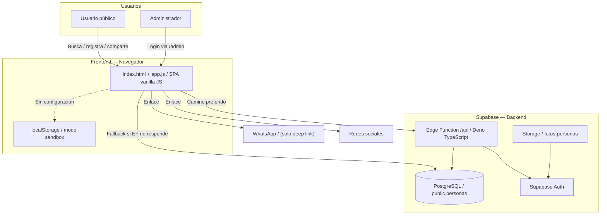
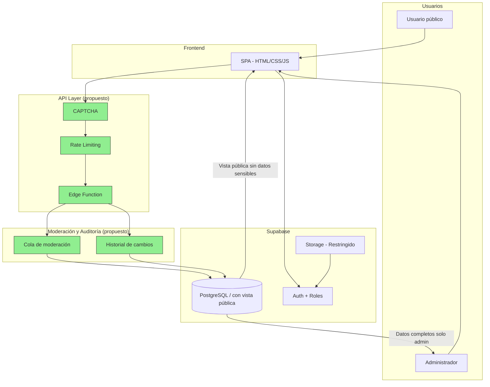

# Aquí Estoy Venezuela

> Entrada general, comprensión rápida y navegación del proyecto.

## Audiencia

Todos: ciudadanía, voluntariado, coordinación, producto, desarrollo, datos, seguridad, QA, DevOps y gestión de proyectos.

## Qué responde este documento

Qué es el proyecto, qué hace hoy, qué está verificado, qué riesgos existen y qué documento leer después.

## Estado y fecha de revisión

- Fecha: 2026-06-29.
- Rama: `docs/audit-and-current-architecture`.
- Referencia local: `8d7dfcb442772099958efc8578db124a7b3a7bff`.
- Estado: revisión documental Codex; no confirma despliegue productivo ni sustituye validación humana.

**Directorio web de emergencia para la búsqueda y localización de personas en Venezuela.**

> ⚠️ **Advertencia de privacidad**: Actualmente **toda la información de la tabla de personas es de lectura pública**, incluyendo teléfonos y datos sensibles. Ver [Seguridad y privacidad](#seguridad-y-privacidad).

---

## Resumen ejecutivo

| Pregunta | Respuesta breve |
|---|---|
| **¿Qué hace?** | Permite buscar personas reportadas, registrar desaparecidos, y que administradores actualicen estados e importen listados. |
| **¿Quién lo usa?** | Ciudadanos (búsqueda y reporte sin registro) y administradores autorizados (gestión con login). |
| **¿De dónde vienen los datos?** | Formulario público en la web, importación CSV por administradores, y datos demo para pruebas. |
| **¿Dónde se guardan?** | Base de datos PostgreSQL en Supabase. También almacenamiento local del navegador en modo demo. |
| **¿Qué puede ver el público?** | Actualmente TODO: nombres, cédulas, edades, ubicaciones, teléfonos, observaciones y estados. |
| **¿Qué puede hacer un administrador?** | Iniciar sesión, actualizar estado, eliminar reportes e importar archivos CSV. |
| **¿Qué está verificado?** | El código del repositorio fue verificado. El despliegue real en producción NO pudo verificarse. |
| **¿Principal riesgo actual?** | Exposición pública de datos personales sensibles (P0). El panel administrativo tiene un bug que impide su visualización (P0). |

---

## Navegación rápida

- [Entender el proyecto en cinco minutos](#entender-el-proyecto-en-cinco-minutos)
- [Capacidades actuales](#capacidades-actuales)
- [Cómo funciona para una persona no técnica](#cómo-funciona-para-una-persona-no-técnica)
- [Origen, recorrido y destino de los datos](#origen-recorrido-y-destino-de-los-datos)
- [Calidad y confiabilidad de la información](#calidad-y-confiabilidad-de-la-información)
- [Seguridad y privacidad](#seguridad-y-privacidad)
- [Arquitectura actual](#arquitectura-actual)
- [Estado técnico verificable](#estado-técnico-verificable)
- [Ejecución local](#ejecución-local)
- [Despliegue](#despliegue)
- [Pull requests y trabajo pendiente](#pull-requests-y-trabajo-pendiente)
- [Arquitectura objetivo](#arquitectura-objetivo)
- [Documentación especializada](#documentación-especializada)
- [Contribuir](#contribuir)

---

## Entender el proyecto en cinco minutos

### ¿Qué problema resuelve?

En emergencias, la información de personas desaparecidas queda dispersa en chats de WhatsApp, redes sociales, llamadas y hojas de cálculo. Esta fragmentación dificulta encontrar datos rápidamente y provoca duplicación.

El proyecto centraliza esa información en un solo lugar accesible desde cualquier navegador.

### Flujo completo en términos simples

```
Persona reporta    →  Formulario web o archivo CSV
                         ↓
                    Validación (nombre y cédula obligatorios)
                         ↓
                    Verificación de duplicado por cédula
                         ↓
                    Base de datos (PostgreSQL en Supabase)
                         ↓
                    Búsqueda pública (cualquier visitante)
                         ↓
                    Administrador actualiza estado o importa más datos
```

### Qué está verificado y qué no

| Categoría | Estado | Etiqueta |
|-----------|:------:|----------|
| Código frontend (HTML, CSS, JS) | Revisado y funcional en modo sandbox | **Verificado en código** |
| Modo sandbox/demo | Funcional sin backend | **Probado localmente** |
| Esquema de base de datos (schema.sql) | Definido en el repositorio | **Configurado, no verificado** |
| Edge Function (API) | Código escrito en el repositorio | **Configurado, no verificado** |
| Supabase Auth | Configurado en código | **Configurado, no verificado** |
| Despliegue en producción | Existe HTML observado con datos reales pero con versiones diferentes al repositorio | **Observado en HTML, no verificado** |
| Dominio aquiestoyvenezuela.com | Configurado en nginx.conf | **Configurado, no verificado** |
| SSL/HTTPS | Configurado en nginx.conf pero con error que impide el inicio | **Configurado, no funcional** |

> ⚠️ **Version drift**: El HTML observado en producción referencia CSS `?v=13`, JS `?v=12` y config `?v=7`, mientras que el repositorio contiene `?v=8`, `?v=11` y `?v=6`. El código en producción es **diferente** al del repositorio.

---

## Capacidades actuales

### Funciones públicas

| Capacidad | Estado | Verificación |
|-----------|:------:|:------------:|
| Buscar personas por nombre o cédula | **Funcional** | Probado en sandbox |
| Filtros por estado, edad, ubicación | **Funcional** | Verificado en código |
| Ver estadísticas generales | **Funcional** | Probado en sandbox |
| Ver detalle de cada persona | **Funcional** | Verificado en código |
| Compartir en redes sociales y WhatsApp (enlace) | **Funcional** | Verificado en código |
| Registrar públicamente un desaparecido | **Funcional** | Verificado en código |
| Detección de duplicados por cédula | **Parcial** | Usa ILIKE con substring — falsos positivos posibles |
| Paginación ("Cargar más") | **Funcional** | Probado en sandbox |

### Funciones administrativas

| Capacidad | Estado | Verificación |
|-----------|:------:|:------------:|
| Inicio de sesión (Supabase Auth) | **Configurado** | Código existe, no verificado con Supabase real |
| Actualizar estado (Desaparecido/Encontrado) | **Configurado** | Código existe |
| Eliminar reportes | **Configurado** | Sin soft delete — eliminación permanente |
| Importar registros por CSV | **Funcional** | Probado en sandbox |
| Panel de administración | ⚠️ **Bug P0** | `id="admin-panel"` duplicado — el panel no se muestra |

### Modo demostración

| Capacidad | Estado |
|-----------|:------:|
| Sandbox completo con localStorage | **Funcional** |
| Datos de demostración | **Funcional** (5 personas ficticias) |
| Admin de prueba | **Funcional** (credenciales hardcodeadas) |

---

## Cómo funciona para una persona no técnica

> Para una explicación detallada con escenarios paso a paso, ver [docs/HOW_THE_PROJECT_WORKS.md](./docs/HOW_THE_PROJECT_WORKS.md).

### Buscar a una persona

1. Abrís la página y ves tres números: total de reportados, buscados y localizados.
2. Escribís un nombre o cédula en el buscador y presionás Enter.
3. Aparecen tarjetas con la información de cada persona que coincide.
4. Si no hay resultados, la página ofrece un formulario para reportar a la persona como desaparecida.

### Reportar a una persona desaparecida

1. Completás el formulario con nombre y cédula (obligatorios) y datos adicionales (edad, teléfono, ubicación, observaciones).
2. El sistema verifica que no exista otra persona con esa misma cédula.
3. Si no existe, guarda el reporte con estado "Desaparecido".

### Qué hace un administrador

1. Entra a `/admin`, inicia sesión con su correo y contraseña.
2. Puede cambiar el estado de una persona (de Desaparecido a Encontrado, o viceversa).
3. Puede eliminar reportes (la eliminación es permanente).
4. Puede cargar un archivo CSV con muchos registros para importarlos de una vez.

### ⚠️ Lo que el sistema NO hace

- **No modera reportes**: cualquier persona puede publicar un reporte sin revisión previa.
- **No verifica identidad**: no hay CAPTCHA ni verificación humana.
- **No guarda historial**: cuando un administrador modifica datos, la información anterior se pierde.
- **No protege datos sensibles**: teléfonos, observaciones médicas y datos de quien reportó son visibles públicamente.
- **WhatsApp NO está integrado**: el botón solo abre la aplicación con un mensaje pre-escrito. No recibe ni procesa mensajes.

---

## Origen, recorrido y destino de los datos

### ¿De dónde provienen los datos?

| Fuente | Canal | Estado |
|--------|-------|:------:|
| Formulario público en la web | Navegador → API | **Implementado** |
| Importación de archivo CSV | Panel admin → API | **Implementado** |
| Datos de demostración | Código (app.js y schema.sql) | **Implementado** |
| WhatsApp (solo enlace para compartir) | Deep link — no recibe datos | **Solo enlace** |

### ¿Cómo ingresan los datos?

**Formulario público**: el usuario completa un formulario, el frontend valida nombre y cédula, verifica que no exista un duplicado, y envía los datos a la API o directamente a Supabase. Se guarda con estado inicial "Desaparecido".

**Importación CSV**: un administrador carga un archivo. PapaParse (librería JavaScript) lo lee en el navegador. El sistema identifica columnas por palabras clave en los encabezados (`nom`→nombre, `ced`→cédula, `edad`→edad, etc.). Los registros se envían a la API y se guardan con upsert por cédula (actualiza si existe, inserta si no).

> ⚠️ **Riesgo de importación**: El importador actual **siempre fuerza `estado: 'Desaparecido'`** y **sobrescribe** registros existentes. Si una persona ya estaba marcada como "Encontrado", una reimportación la revierte a "Desaparecido". Además, el mapeo de columnas usa coincidencia por substrings — extremadamente frágil (ej: `'ci'` dentro de `'ubicaCIón'` o `'observaCIones'`).

**Modo demo**: si no existe `config.js`, la app funciona completamente con datos ficticios en localStorage.

### ¿Dónde se almacenan los datos?

| Tipo de información | Dónde se guarda | ¿Verificado? |
|--------------------|-----------------|:------------:|
| Nombres, cédulas, edades, ubicaciones, estados | PostgreSQL (Supabase) | Configurado, no verificado |
| Fotografías | Supabase Storage (bucket `fotos-personas`) | Configurado, sin interfaz de carga |
| Datos de demostración | localStorage del navegador | Probado localmente |
| Sesión de administrador | Supabase Auth (cookies/localStorage) | Configurado, no verificado |
| Configuración | Archivo `static/js/config.js` (ignorado por Git) | No verificado |

### ¿Qué información es pública?

Actualmente **toda la tabla `personas` es de lectura pública** (política RLS: `USING (true)`). Esto incluye:

- Nombre, cédula, edad y ubicación (apropiadamente públicos para búsqueda)
- **Teléfono de contacto** (debería ser privado)
- **Nombre y cédula de quien reportó la localización** (debería ser privado)
- **Observaciones** que pueden contener datos médicos o personales (deberían ser privadas)
- **Indicador de menor de edad** (requiere protección especial)

---

## Calidad y confiabilidad de la información

Centralizar información no garantiza que cada dato sea correcto. La auditoría de este repositorio encontró múltiples problemas de calidad.

### Problemas identificados

| Problema | Impacto | Origen |
|----------|:-------:|--------|
| **Cédulas vacías en pantalla** | Usuario no puede verificar identidad | Columna CSV no mapeada o celda vacía |
| **Números de documento dentro del nombre** | Confusión sobre identidad | CSV fuente con campos concatenados |
| **Edades en campo de ubicación** | Información de localización inútil | Admin ingresó datos compuestos en formulario de estado |
| **Prefijos numéricos en ubicaciones** (ej: `22_LA GUAIRA`) | Búsqueda por ubicación devuelve ruido | Datos CSV sin limpiar |
| **Cédulas duplicadas por formato** (`V-12345678` vs `V-12.345.678`) | Misma persona con dos registros | El formulario normaliza la cédula; el CSV no |
| **Estadísticas inconsistentes** (total ≠ desaparecidos + encontrados) | Desconfianza en los números | Posible mezcla entre sandbox y Supabase, o versiones de código diferentes |
| **Upsert destructivo en CSV** | Personas "Encontrado" revierten a "Desaparecido" | El importador fuerza `estado:'Desaparecido'` en todos los registros |

### Lo que falta

- [ ] Normalización de cédulas en todas las vías de ingreso
- [ ] Validación de contenido en campos (ej: una ubicación no debería contener edades)
- [ ] Trazabilidad de origen (¿de dónde vino cada registro?)
- [ ] Reporte de filas rechazadas en importación CSV
- [ ] Prevención de sobrescritura de estados verificados
- [ ] Métricas de completitud, validez y unicidad
- [ ] Revisión manual de registros dudosos

---

## Seguridad y privacidad

### Riesgos identificados (ordenados por severidad)

| ID | Hallazgo | Severidad | Descripción |
|----|----------|:---------:|-------------|
| **SEC-01** | Exposición pública de datos sensibles | **P0** | RLS permite SELECT público (`USING (true)`) sobre todas las columnas. Teléfonos, observaciones y datos de quien reportó son visibles para cualquier persona. |
| **SEC-02** | `verifyAdmin()` no verifica rol | **P0** | La Edge Function solo verifica que el usuario esté autenticado, no que tenga rol de administrador. Cualquier usuario registrado en Supabase Auth puede modificar o eliminar registros. |
| **SEC-03** | RLS UPDATE/DELETE para cualquier authenticated | **P0** | Las políticas de actualización y eliminación permiten la operación a cualquier usuario autenticado. |
| **SEC-04** | Sin auditoría de cambios | **P1** | No existe historial de quién modificó qué ni cuándo. Los datos anteriores se pierden al actualizar. |
| **SEC-05** | Sin moderación de reportes | **P1** | Cualquier persona puede insertar reportes sin revisión previa. |
| **SEC-06** | Sin rate limiting | **P2** | No hay límite de velocidad en la API. |
| **SEC-07** | Sin CAPTCHA | **P2** | No hay verificación humana en formularios públicos. |
| **SEC-08** | Bucket de fotos público | **P2** | El bucket `fotos-personas` permite subida pública sin restricción de tipo. |
| **SEC-09** | Sin soft delete | **P2** | La eliminación es física y permanente. |
| **SEC-10** | Error leakage en API | **P2** | Los mensajes de error devuelven información interna de la base de datos. |
| **SEC-11** | CDN sin SRI | **P2** | Los scripts de Supabase JS y PapaParse se cargan sin `integrity`. |

### Sobre la clave de Supabase

| Clave | Dónde está | Clasificación |
|-------|-----------|:------------:|
| `SUPABASE_URL` | `config.js` (template en `config.example.js`) | **Pública** — es la URL del proyecto |
| `SUPABASE_ANON_KEY` | `config.js` (template en `config.example.js`) | **Publicable** — diseñada para uso en cliente bajo RLS |
| `service_role` | No encontrada en el repositorio | **Secreta** — nunca debe llegar al navegador |

> **Correcto**: `config.js` está en `.gitignore`. La anon key es publicable por diseño de Supabase (el acceso real lo controla RLS). La service_role es el verdadero secreto y felizmente no aparece en el código.

### Sobre el cifrado

- **En tránsito**: HTTPS configurado en nginx.conf (aunque el contenedor Docker tiene un error que impide iniciar con TLS).
- **En reposo**: Supabase ofrece cifrado administrado por el proveedor. No se requiere ni se encontró código adicional de cifrado en la aplicación.
- **A nivel de aplicación**: No se encontró cifrado adicional de campos.

### Sobre backups

No se encontraron scripts de backup en el repositorio. Sin embargo, Supabase ofrece Point-in-Time Recovery como servicio administrado. **No se pudo verificar** si esta funcionalidad está habilitada en el proyecto activo.

---

## Arquitectura actual



> **Etiquetas**: ▬▬ Verificado en código &nbsp; - - - Probado localmente &nbsp; ···· Configurado, no verificado

### Dualidad de comunicación (API vs acceso directo)

| Camino | Cuándo se usa | Tecnología |
|--------|:------------:|------------|
| **Edge Function** | Preferido — intenta llamar a la API primero | Deno (TypeScript) en Supabase |
| **Supabase JS directo** | Si la Edge Function no responde | Cliente JS en el navegador |
| **Sandbox** | Si no existe `config.js` | localStorage del navegador |

> ⚠️ **Implicación de seguridad**: el fallback directo a Supabase JS evita las validaciones de la Edge Function y depende exclusivamente de las políticas RLS para control de acceso.

---

## Estado técnico verificable

### Componentes del sistema

| Componente | Código | Despliegue | Estado |
|-----------|:------:|:----------:|:------:|
| Frontend (HTML, CSS, JS) | ✅ | ✅ (con version drift) | **Funcional** |
| Base de datos (schema.sql) | ✅ | ❓ | **Configurado** |
| Edge Function (API) | ✅ | ❓ | **Configurado** |
| Supabase Auth | ✅ | ❓ | **Configurado** |
| Supabase Storage | ✅ | ❓ | **Configurado** |
| Docker / Nginx | ✅ | ❌ (error TLS) | **No funcional** |
| Dominio / SSL | ✅ (config) | ❓ | **No verificado** |
| CI/CD | ❌ | ❌ | **Inexistente** |
| Tests automatizados | ❌ | ❌ | **Inexistente** |
| Backups | ❌ (sin scripts) | ❓ (puede estar en Supabase) | **No verificado** |
| Monitoreo | ❌ | ❌ | **Inexistente** |

> ✅ = Verificado en código &nbsp; ❌ = No encontrado &nbsp; ❓ = No verificable sin acceso

### Bugs conocidos

| ID | Bug | Severidad | Impacto |
|----|-----|:---------:|---------|
| **BUG-01** | `id="admin-panel"` duplicado en `index.html:43` y `index.html:141` | **P0** | El panel de administración nunca se muestra tras login. Bloquea importación CSV y acciones admin. |
| **BUG-02** | HTTPS redirect rompe el contenedor Docker | **P0** | nginx.conf redirige HTTP→HTTPS pero no hay certificados. El contenedor probablemente no inicia. |
| **BUG-03** | CSV import fuerza `estado:'Desaparecido'` y sobrescribe encontrados | **P1** | Una reimportación revierte personas localizadas a desaparecidas. |
| **BUG-04** | Mapeo de columnas CSV por substring matching | **P1** | `'ci'` matchea dentro de `'ubicaCIón'` y `'observaCIones'`. Campos intercambiados. |
| **BUG-05** | Sin botón "Reportar Desaparecido" visible sin buscar primero | **P1** | Un ciudadano que quiere reportar debe saber que tiene que buscar antes. |
| **BUG-06** | `schema.sql` expuesto públicamente en la imagen Docker | **P1** | Cualquier persona puede leer la estructura completa de la base de datos. |

---

## Ejecución local

### Modo sandbox (sin backend, sin instalar nada)

Abrí `index.html` en tu navegador. La app detecta que no hay configuración de Supabase y entra en modo demo con datos ficticios.

### Modo con Supabase (requiere proyecto Supabase)

```bash
git clone https://github.com/Open-Vzla-SOS/aquiestoyvenezuela-web.git
cd aquiestoyvenezuela-web
cp static/js/config.example.js static/js/config.js
# Editar config.js con SUPABASE_URL y SUPABASE_ANON_KEY de tu proyecto
# Ejecutar schema.sql en el SQL Editor de Supabase
# Abrir index.html en el navegador
```

### Con Docker

```bash
docker compose up --build -d
```

> ⚠️ El contenedor Docker tiene un error que impide iniciar con HTTPS. Para desarrollo local, editar `nginx.conf` eliminando el bloque `listen 443 ssl` y el `return 301 https://`.

---

## Despliegue

### Stack tecnológico

| Capa | Tecnología |
|------|-----------|
| Frontend | HTML5, CSS3, JavaScript vanilla |
| API | Supabase Edge Functions (Deno + TypeScript) |
| Base de datos | PostgreSQL (Supabase) |
| Autenticación | Supabase Auth (email + contraseña) |
| Almacenamiento | Supabase Storage |
| Servidor web | Nginx (Alpine) en Docker |
| CSV | PapaParse 5.4.1 (CDN) |

### Lo que NO está configurado

- **Sin CI/CD**: no hay GitHub Actions ni automatización de despliegue.
- **Sin tests**: no se encontraron pruebas automatizadas de ningún tipo.
- **Sin monitoreo**: no hay health checks, logging estructurado ni alertas.
- **Sin backups documentados**: no hay scripts ni documentación de respaldo.

---

## Pull requests y trabajo pendiente

### PRs abiertos (al 2026-06-29)

| PR | Título | Autor | Estado | Archivos | Notas |
|----|--------|:-----:|:------:|:--------:|-------|
| #13 | Optimización UI/UX con BEM, Modo Oscuro | rebecadev10 | Abierto | 3 | +908/-1203, 1 commit masivo, refactor de nomenclatura |
| #12 | ui: nav, vista lista/grid y paginación | JoseJEspinoza | Abierto | 4 | +834/-140, 3 commits, fork externo |

> **Ambos PRs están en conflicto** (modifican los mismos archivos). Ver [docs/PULL_REQUEST_REVIEW.md](./docs/PULL_REQUEST_REVIEW.md) para análisis detallado y recomendación de integración.

### Issues

| Issue | Estado | Descripción |
|-------|:------:|-------------|
| #11 | Abierto | "make responsive all app" |

---

## Arquitectura objetivo

Propuesta de mejoras incrementales sobre la arquitectura actual:



> ▬▬ Componentes actuales &nbsp; 🟢 Componentes propuestos

---

## Documentación especializada

| Documento | Audiencia | Pregunta que responde |
|-----------|:---------:|----------------------|
| [README.md](./README.md) | Todos | ¿Qué es y cuál es su estado? |
| [HOW_THE_PROJECT_WORKS.md](./docs/HOW_THE_PROJECT_WORKS.md) | No técnicos | ¿Cómo funciona paso a paso? |
| [ARCHITECTURE.md](./docs/ARCHITECTURE.md) | Técnicos | ¿Cómo está construido? |
| [DATA_SOURCES_STORAGE_AND_HOSTING.md](./docs/DATA_SOURCES_STORAGE_AND_HOSTING.md) | Datos/infraestructura | ¿De dónde vienen y dónde terminan los datos? |
| [AUDIT_CURRENT_STATE.md](./docs/AUDIT_CURRENT_STATE.md) | Líderes y auditores | ¿Qué riesgos y brechas existen? |
| [PULL_REQUEST_REVIEW.md](./docs/PULL_REQUEST_REVIEW.md) | Mantenedores | ¿Qué cambios están pendientes? |
| [RECOMMENDED_BACKLOG.md](./docs/RECOMMENDED_BACKLOG.md) | Equipo | ¿Qué debería hacerse y en qué orden? |
| [AUDIT_EXECUTION_LOG.md](./docs/AUDIT_EXECUTION_LOG.md) | Auditores | ¿Cómo se ejecutó la revisión? |

### ¿Por dónde comenzar?

- **Familiar o ciudadano**: Leé [Cómo funciona](#cómo-funciona-para-una-persona-no-técnica) y [HOW_THE_PROJECT_WORKS.md](./docs/HOW_THE_PROJECT_WORKS.md).
- **Voluntario**: Leé [Capacidades actuales](#capacidades-actuales) y [Origen de los datos](#origen-recorrido-y-destino-de-los-datos).
- **Coordinador no técnico**: Leé [Entender el proyecto](#entender-el-proyecto-en-cinco-minutos) y [Calidad de datos](#calidad-y-confiabilidad-de-la-información).
- **Desarrollador**: Leé [Arquitectura actual](#arquitectura-actual) y [ARCHITECTURE.md](./docs/ARCHITECTURE.md).
- **Administrador de sistema**: Leé [Despliegue](#despliegue) y [DATA_SOURCES_STORAGE_AND_HOSTING.md](./docs/DATA_SOURCES_STORAGE_AND_HOSTING.md).
- **Auditor de seguridad**: Leé [Seguridad](#seguridad-y-privacidad) y [AUDIT_CURRENT_STATE.md](./docs/AUDIT_CURRENT_STATE.md).
- **Colaborador de datos**: Leé [Calidad de datos](#calidad-y-confiabilidad-de-la-información).

---

## Contribuir

### Reportar problemas

Abrí un [issue](https://github.com/Open-Vzla-SOS/aquiestoyvenezuela-web/issues) describiendo el problema, pasos para reproducir y comportamiento esperado.

### Enviar cambios

1. Hacé fork del repositorio.
2. Creá una rama descriptiva.
3. Probá tus cambios en modo sandbox (si tocás frontend) o contra un proyecto Supabase de prueba.
4. Enviá un Pull Request.

### Buenas prácticas

- Mantené sincronía entre Edge Function y fallback directo a Supabase.
- No incluyas claves, tokens ni datos reales en commits.
- `config.js` está en `.gitignore` — usá `config.example.js` como template.

---

## Contacto

- **Repositorio**: [github.com/Open-Vzla-SOS/aquiestoyvenezuela-web](https://github.com/Open-Vzla-SOS/aquiestoyvenezuela-web)
- **Sitio web**: [aquiestoyvenezuela.com](https://aquiestoyvenezuela.com) (si está desplegado)

---

> 📋 **Última actualización de esta documentación**: 2026-06-29 — Reauditoría independiente, rama `docs/audit-and-current-architecture`.
> Esta documentación fue verificada contra el código del repositorio en el commit `8d7dfcb`. El despliegue en producción NO fue verificado y presenta diferencias de versión con el repositorio.

## Estados documentales usados

| Estado | Significado |
|---|---|
| Verificado en código | Confirmado en archivos del repositorio local. |
| Probado localmente | Ejecutado en esta revisión y observado localmente. |
| Observado | Visto en evidencia externa o herramienta, indicando fecha/fuente. |
| Configurado, no verificado | Existe configuración, pero no se probó el servicio real. |
| Documentado, no implementado | Aparece en documentación, no se encontró implementación. |
| Propuesto | Recomendación o arquitectura objetivo. |
| No encontrado | Se buscó evidencia y no apareció. |
| No verificable | Requiere acceso, ambiente o decisión fuera de esta revisión. |
