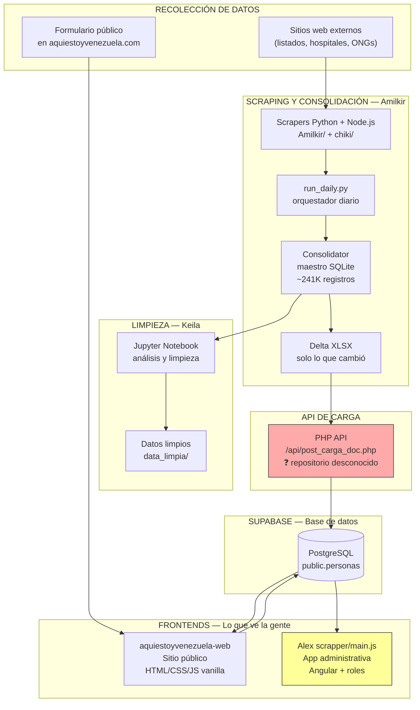

# Entendiendo el proyecto Aquí Estoy Venezuela

> **Documento para Harry** — Visión general del proyecto con todos sus repositorios.
> No es para compartir. Explica cómo están conectados y qué falta por entender.
> Última actualización: 2026-06-29

---

## ¿De qué va todo esto?

El proyecto **Aquí Estoy Venezuela** es una plataforma para ayudar a encontrar personas durante emergencias en Venezuela. Pero "la plataforma" no es un solo sistema — es como un rompecabezas de varias piezas que están en repositorios distintos y se conectan entre sí.

Pensalo así: hay personas que **juntan información** de distintas fuentes, hay un sistema que **la organiza y la limpia**, y hay sitios web que **la muestran al público**. Cada parte está en un repositorio diferente y hecha por personas distintas.

---

## Los repositorios del proyecto

### 1. `aquiestoyvenezuela-web` — El sitio público principal 🟢

**Repositorio**: https://github.com/Open-Vzla-SOS/aquiestoyvenezuela-web

**¿Qué es?** La página web que ve cualquier persona cuando entra a `aquiestoyvenezuela.com`. Es donde la gente busca personas, ve estadísticas y reporta desaparecidos.

**¿Cómo está hecho?** HTML, CSS y JavaScript vanilla (sin frameworks). Se conecta a Supabase (una plataforma que provee base de datos, autenticación y almacenamiento en la nube).

**¿Qué se puede hacer acá?**
- Buscar personas por nombre o cédula
- Ver estadísticas (total de reportados, desaparecidos, localizados)
- Reportar una persona desaparecida
- Administradores pueden iniciar sesión y actualizar estados
- Importar listados desde archivos CSV

**¿Cómo se conecta con los otros repos?** Es el destino final de los datos. Las personas que se ven en esta página llegan desde los scrapers (repo de Amilkir) o desde formularios públicos.

**Estado**: Funcional, pero con bugs identificados (panel admin roto, datos sensibles expuestos).

---

### 2. `scrapper` (Alex) — La aplicación administrativa + scrapers 🟡

**Repositorio**: https://github.com/Alex1011m/scrapper

**¿Qué es?** Este repositorio tiene DOS cosas distintas:

#### 2a. Una aplicación Angular completa

Es una **aplicación web separada**, hecha con Angular (un framework de Google), que NO es la misma que el sitio público. Tiene su propio sistema de autenticación con roles:

- **admin**: acceso total a pacientes y usuarios
- **supervisor**: acceso a pacientes
- **encargado**: acceso a pacientes
- **digitador**: acceso a pacientes (lectura y creación)
- **registrador**: acceso a pacientes (solo lectura)

Esta app maneja "centros" (hospitales, refugios) y asigna permisos por centro. Es una aplicación interna para gestión administrativa.

**Dependencias**: `@supabase/supabase-js`, `node-cron`, `puppeteer`

#### 2b. Scrapers en JavaScript

Varios archivos (`scraper.js`, `scraper2.js`... hasta `scraper6.js`) que se conectan directamente a la **misma base de datos de Supabase** que usa el sitio público. Lo que hacen es **leer datos**, no insertarlos.

El `scraper.js` principal lee TODOS los registros de la tabla `personas` usando la REST API de Supabase (con la misma clave anónima del sitio público) y los guarda en archivos JSON/CSV locales.

También tiene `cron_service.js` que probablemente ejecuta estos scrapers de forma programada.

**¿Por qué existe esto separado?** Porque parece que Alex construyó una interfaz administrativa propia (Angular) en vez de usar el panel admin que ya existe en el sitio público (que además tiene un bug que impide usarlo). Y los scrapers extraen datos para tener copias locales o alimentar otros procesos.

---

### 3. `aevscraping` (Amilkir) — El pipeline de scraping masivo 🟠

**Repositorio**: https://github.com/Amilkir/aevscraping

**¿Qué es?** Un sistema automatizado que recolecta datos de personas desaparecidas desde **múltiples fuentes externas** (páginas web, listados, archivos), los consolida, y los envía a la base de datos.

**¿Cómo funciona?**

```
Cada día, automáticamente:

1. Los SCRAPERS recolectan datos de distintas fuentes
   ├── Amilkir/scraper.js     → scraper Node.js
   ├── chiki/scraper.py        → scraper Python  
   ├── chiki/scraper_terremoto.py
   └── chiki/scraper_pacientesve.py

2. run_daily.py junta todo en un solo archivo JSON
   → datos_consolidados/todos_registros.json

3. generate_xlsx.py convierte el JSON a Excel
   → datos_consolidados/todos_registros.xlsx

4. send_to_api.py sube el Excel a la API
   → https://aquiestoyvenezuela.com/api/post_carga_doc.php
```

**El consolidator** (la parte más sofisticada):

Es un sistema que mantiene una **base de datos maestra** en SQLite con todas las personas (menciona ~241,000 registros). En vez de reenviar todo cada día, solo envía **lo que cambió** (el "delta"): los registros nuevos y los que se modificaron. Esto es mucho más eficiente.

El consolidator:
- Mantiene un maestro con 16 columnas (igual que la tabla `personas`)
- Compara cada nueva corrida contra el maestro
- Detecta altas, bajas y cambios
- Genera archivos XLSX de máximo 5 MB cada uno
- Los sube automáticamente a la API

**La API de destino**: envía los datos a `https://aquiestoyvenezuela.com/api/post_carga_doc.php` — una URL que **NO es la Edge Function de Supabase** que usa el sitio público. Es un endpoint PHP separado. Esto significa que hay **otro backend** (probablemente en PHP) que recibe estos datos y los inserta en Supabase.

**Variables de entorno que usa**:
- `AEV_API_URL` → la URL de la API PHP
- `AEV_API_KEY` → clave de autenticación para la API
- `AEV_ID_USUARIO` → ID del usuario que hace la carga
- `AEV_ID_HOSPITAL` → ID del hospital/centro asociado

---

### 4. `aevdata_cleaning` (Keila) — Limpieza y análisis de datos 🔵

**Repositorio**: https://github.com/keyladiazv/aevdata_cleaning

**¿Qué es?** Un proyecto de análisis de datos que toma el archivo consolidado que genera Amilkir y lo limpia.

**¿Cómo funciona?**

```
1. Toma el archivo de Amilkir
   → todos_registros.xlsx (desde aevscraping)

2. Lo copia a data_raw/

3. Ejecuta un notebook de Jupyter
   → 01_exploracion_dataset.ipynb

4. Analiza y limpia los datos
   → Versión limpia en data_limpia/
```

Las columnas que maneja son las mismas que la tabla `personas` del sitio público, más una columna extra: **Fuente** (de dónde vino cada registro).

**Dependencias**: pandas, numpy, Jupyter notebooks.

---

## Cómo se conecta todo — El flujo completo



---

## Lo que se entiende hasta ahora

### ✅ Conexiones confirmadas

| Desde | Hacia | Cómo | Evidencia |
|-------|-------|------|-----------|
| `aquiestoyvenezuela-web` | Supabase | Edge Function (`/functions/v1/api/`) o cliente JS directo | `app.js` |
| `scrapper` (Alex) | Supabase | REST API directa (`/rest/v1/personas`) | `scraper.js` usa misma URL y anon key |
| `scrapper` (Alex) Angular | ¿Supabase? | La app Angular (`main.js`) tiene sistema de auth propio | `main.js` con tokens y roles |
| `aevscraping` (Amilkir) | PHP API | `POST /api/post_carga_doc.php` con X-API-Key | `send_to_api.py`, `consolidator/lib/api.py` |
| `aevdata_cleaning` (Keila) | `aevscraping` | Lee `todos_registros.xlsx` del consolidator | `README.md` |
| `aquiestoyvenezuela-web` | `aevscraping` | No hay conexión directa en el código. Los datos del scraping entran por la API PHP, no por el sitio público. | — |

### ✅ Lo que cada repo hace

| Repo | Responsable | Propósito | Tecnología |
|------|:----------:|-----------|------------|
| `aquiestoyvenezuela-web` | Open-Vzla-SOS | Sitio público: búsqueda, reporte, admin | HTML/CSS/JS vanilla + Supabase |
| `scrapper` | Alex | App admin (Angular) + scrapers JS + cron jobs | Angular, Node.js, Puppeteer, Supabase JS |
| `aevscraping` | Amilkir | Pipeline scraping masivo + consolidator + envío a API | Python, Node.js, SQLite |
| `aevdata_cleaning` | Keila | Limpieza y análisis de datos | Python (pandas, Jupyter) |

---

## Lo que NO se entiende — Preguntas para el equipo técnico

### 🔴 El backend PHP

1. **¿Dónde está el código del backend PHP** (`/api/post_carga_doc.php`)?
   - Amilkir envía datos a `https://aquiestoyvenezuela.com/api/post_carga_doc.php`
   - Este endpoint NO está en ninguno de los 4 repositorios
   - ¿Hay otro repositorio con el backend PHP?
   - ¿O está dentro del servidor y nunca se versionó?

2. **¿Qué hace exactamente ese endpoint PHP?**
   - ¿Inserta directamente en Supabase?
   - ¿Usa la Edge Function de Supabase como intermediario?
   - ¿Tiene su propia lógica de validación?
   - ¿Cómo maneja los duplicados?

3. **¿Quién mantiene el servidor donde corre el PHP?**
   - ¿Es un VPS? ¿Hosting compartido?
   - ¿Cómo se despliega?
   - ¿Hay acceso al código?

### 🟡 La aplicación Angular de Alex

4. **¿La app Angular es un sistema separado o un reemplazo del sitio público?**
   - Tiene su propio sistema de roles (admin, supervisor, encargado, digitador, registrador)
   - Maneja "centros" (hospitales/refugios)
   - ¿Está en producción? ¿En qué URL?
   - ¿Quién la usa?

5. **¿Cómo se autentica la app Angular?**
   - ¿Usa Supabase Auth igual que el sitio público?
   - ¿O tiene su propio backend de autenticación?
   - El código menciona tokens con scopes (`patients:read`, `users:create`, etc.)

6. **¿La app Angular y el sitio público comparten la misma base de datos?**
   - Ambos apuntan a `fnrghfvcnlsczuqwskzg.supabase.co`
   - ¿La app Angular también usa RLS o tiene su propio control de acceso?

### 🟠 El pipeline de datos

7. **¿Cómo se coordina el scraping diario de Amilkir con el sitio público?**
   - El consolidator mantiene ~241,000 registros
   - ¿Esos registros están todos en la tabla `personas` de Supabase?
   - ¿O el maestro de SQLite es independiente?

8. **¿Qué fuentes externas se están scrapeando?**
   - `Amilkir/scraper.js`, `chiki/scraper_terremoto.py`, `chiki/scraper_pacientesve.py`
   - ¿De qué sitios web vienen los datos?
   - ¿Hay autorización para usar esos datos?

9. **¿Por qué hay scrapers TAMBIÉN en el repo de Alex?**
   - Alex tiene `scraper.js` hasta `scraper6.js`
   - Amilkir también tiene scrapers
   - ¿Se duplican esfuerzos? ¿Tienen propósitos distintos?

### 🔵 Limpieza de datos

10. **¿El análisis de Keila ya detectó los problemas de calidad que encontramos en la auditoría?**
    - Campos intercambiados (cédulas en nombre, edades en ubicación)
    - Cédulas sin normalizar
    - El notebook de Keila tiene la columna "Fuente" — ¿eso significa que ya hay trazabilidad?

11. **¿La versión limpia de Keila se vuelve a cargar en Supabase?**
    - ¿O es solo para análisis?
    - ¿Hay un ciclo de retroalimentación?

### ⚫ Infraestructura y despliegue

12. **¿Dónde está desplegado cada componente?**
    - Sitio público (aquiestoyvenezuela.com) — ¿Docker? ¿VPS?
    - App Angular de Alex — ¿Dónde?
    - Scraper de Amilkir — ¿Corre en una computadora? ¿Un servidor?
    - ¿Hay un solo servidor o varios?

13. **¿Cómo se gestionan los secretos y claves?**
    - La API key de Amilkir aparece en `send_to_api.py` y `consolidator/lib/api.py`
    - ¿Esa clave está rotada? ¿Quién la genera?
    - La anon key de Supabase está en varios repos — ¿es la correcta?

14. **¿Hay ambientes separados (producción, staging, desarrollo)?**
    - ¿O todo apunta a la misma base de datos de Supabase?

### 🔴 Seguridad y datos

15. **¿Quién tiene acceso a la base de datos de Supabase?**
    - ¿Solo el service_role? ¿O hay usuarios con acceso directo?
    - La auditoría encontró que cualquier usuario autenticado puede modificar datos

16. **¿Cómo se protegen los datos de menores?**
    - La tabla `personas` tiene un campo `es_menor`
    - ¿Hay políticas especiales para esos registros?

17. **¿Existe una política de privacidad y retención de datos?**
    - ¿Por cuánto tiempo se guardan los datos?
    - ¿Cómo se eliminan si alguien lo solicita?

---

## Resumen de lo que hay que pedirle al equipo

### Prioridad urgente (para armar la arquitectura)

1. **Acceso al repositorio del backend PHP** — sin esto no se entiende cómo entran los datos masivos del scraping
2. **Confirmar si la app Angular de Alex está en producción** y cómo se relaciona con el sitio público
3. **Un diagrama del servidor**: ¿qué corre dónde? ¿Docker? ¿VPS? ¿Hosting compartido?
4. **Lista de fuentes de datos externas** que se están scrapeando

### Prioridad media (para completar el entendimiento)

5. ¿El pipeline de Amilkir corre automáticamente todos los días? ¿En qué máquina?
6. ¿Keila ya generó datos limpios? ¿Se volvieron a cargar?
7. ¿Hay coordinación entre Alex, Amilkir y Keila, o cada uno trabaja independiente?
8. ¿Quién es el dueño del proyecto Supabase? ¿Quién paga la cuenta?

### Prioridad baja (mejora continua)

9. ¿Hay documentación de decisiones de arquitectura?
10. ¿Existe un roadmap del proyecto?
11. ¿Cómo se comunican entre los contribuidores?

---

## Próximos pasos recomendados

1. **Conseguir acceso al repo del backend PHP** (o confirmar que no existe y está en el servidor)
2. **Hacer una videollamada con Alex** para entender su app Angular y los scrapers
3. **Revisar el consolidator de Amilkir** con más detalle — es la pieza más sofisticada del pipeline
4. **Unir el análisis de Keila** con los hallazgos de la auditoría de calidad de datos
5. **Crear una arquitectura unificada** que muestre cómo se conectan TODAS las piezas
6. **Priorizar la migración a React** que ya empezó en `aquiestoyvenezuela-web`

---

> 📋 Este documento es un análisis preliminar basado en el código disponible en 4 repositorios. Faltan piezas clave (backend PHP, despliegue real) que requieren conversación con el equipo.
